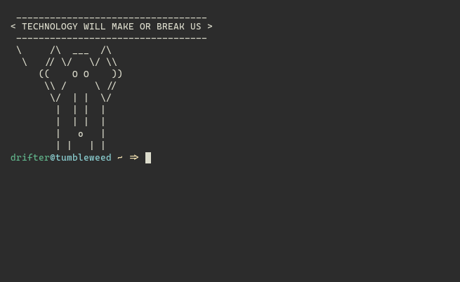

# Shell Bookmarks

  

My implementation of bookmarks for the shell.   
Designed to goto working directories quickly and reduce cognitive load of remembering bookmark names.

## Setup & Install:  
- Please clone with `git clone git@github.com:Emceelamb/shell-bookmarks.git --recursive`  
- Please add `source <yourScriptsDirectory>/shell-bookmarks.sh` to your `.bashrc` file  
- or `source <yourScriptsDirectory/no_color_shell-bashmarks.sh` if your terminal doesn't support ANSI color codes.

## Usage:
`bmk s` - Saves the current location to your bookmarks  
`bmk l` - Lists bookmarked location  
`bmk g` <bookmark number> - Go to to bookmarked location  
`bmk d` <bookmark number> - Deletes bookmarked location  
`bmk clear` - Deletes all bookmarks  

__Extras__:  
`bmk <bookmark number>` - Go to bookmarked location if exists  
`bmk <invalid argument>` - Lists valid commands  
`bmk (no args)` - Defaults to list bookmarks  

Bookmarks are saved in `$HOME/.shellbookmarks`

## Acknowledgments
Loosely inspired by [huyng/bashmarks](https://github.com/huyng/bashmarks/)  
Curses library by [metal3d](https://github.com/metal3d/bashsimplecurses)

hi
